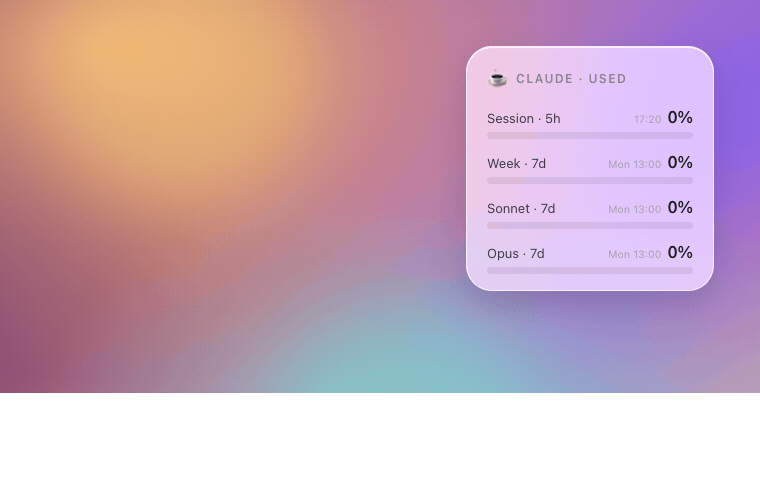

<div align="center">

# ☕ Claude Usage Widget

### Always know how much of your Claude limit is left — right on your macOS desktop.

A clean, native-looking desktop widget that shows your **Claude / Claude Code** usage limits in real time. No browser tab, no `/usage` command, no guessing how close you are to the wall. Just a glance.

[](https://www.apple.com/macos/)
[](https://tracesof.net/uebersicht/)
[](./LICENSE)
[](#-contributing)
[](https://github.com/alexgrygoriev/claude-usage-widget/stargazers)



<sub>The desktop card — plus a menu-bar variant if you prefer it tiny.</sub>

<sub>⭐ If this saved you from a surprise rate-limit, drop a star — it genuinely helps.</sub>

</div>

---

## Why

If you use **Claude Code** (or Claude on a Pro/Max plan) all day, you hit the same problem: you never know how much of your **5-hour** and **weekly** allowance is left until you suddenly run out mid-task. The only way to check is to stop and run `/usage`.

This widget puts those exact numbers on your desktop, refreshing itself quietly in the background — the same way the macOS Weather widget just sits there and tells you what you need to know.

## ✨ Features

- 📊 **The real numbers** — pulls from the same official endpoint that powers Claude's `/usage`. Not an estimate from local logs.
- ⏱️ **All your windows at once** — 5-hour session, 7-day rolling, and per-model (Sonnet / Opus) limits, each with its reset time.
- 🎨 **Native, airy design** — frosted-glass card that blends into your wallpaper like a first-party widget.
- 🟢🟡🔴 **Traffic-light bars** — green while you have room, amber as it fills, red when you're about to hit the wall.
- 🔌 **Auto-refresh** — updates every 5 minutes; never touches the network more than it needs to.
- 💾 **Survives rate-limits & offline** — caches the last good reading, so the card never goes blank.
- 🔐 **Zero secrets stored** — reads your existing Claude token straight from the macOS Keychain at runtime. Nothing is written to disk, nothing is sent anywhere except Anthropic's own API.

## 📦 Requirements

- **macOS 12+**
- **[Übersicht](https://tracesof.net/uebersicht/)** — a free, open-source desktop-widget host (`brew install --cask ubersicht`)
- **[Claude Code](https://docs.claude.com/en/docs/claude-code)** installed and logged in (`claude`) — this is how your Claude token lands in the Keychain. A **Pro** or **Max** subscription is what populates the limits.

> The widget never asks you for an API key or password. It uses the OAuth token that Claude Code already stored for you.

## 🚀 Install

**One line** (installs Übersicht if needed, drops in the widget, launches it):

```bash
curl -fsSL https://raw.githubusercontent.com/alexgrygoriev/claude-usage-widget/main/install.sh | bash
```

<details>
<summary>…or install manually</summary>

```bash
# 1. Install Übersicht (the widget host)
brew install --cask ubersicht

# 2. Clone this repo
git clone https://github.com/alexgrygoriev/claude-usage-widget.git
cd claude-usage-widget

# 3. Drop the widget into Übersicht's widgets folder
cp -R claude-limits.widget "$HOME/Library/Application Support/Übersicht/widgets/"
chmod +x "$HOME/Library/Application Support/Übersicht/widgets/claude-limits.widget/fetch.sh"

# 4. Launch Übersicht
open -a "Übersicht"
```
</details>

On first run, macOS will ask **once** whether Übersicht may use the `Claude Code-credentials` item in your Keychain — click **Always Allow**. The card appears in the top-right corner of your desktop.

> 💡 Übersicht widgets live *on the desktop*, behind your windows. Hide your windows (or press `F11` / swipe to show desktop) to see it. To move or resize it, edit the `top` / `right` / `width` values in `claude-limits.widget/index.jsx`.

## 🧊 Prefer the menu bar?

There's a tiny **menu-bar variant** too (for [SwiftBar](https://github.com/swiftbar/SwiftBar) or [xbar](https://github.com/matryer/xbar)) — same official data, condensed to `☕ 64%` with a dropdown of every window:

```bash
brew install --cask swiftbar     # if you don't have it
cp menubar/claude-limits.5m.sh "$HOME/path/to/your/swiftbar-plugins/"
chmod +x "$HOME/path/to/your/swiftbar-plugins/claude-limits.5m.sh"
```

Point SwiftBar at its plugins folder and you're done. The `.5m.` in the filename sets a 5-minute refresh.

## ⚙️ Configuration

Everything lives in `claude-limits.widget/index.jsx`:

| What | Where | Default |
|------|-------|---------|
| Position | `className` → `top` / `right` | `60px` / `40px` |
| Width | `className` → `width` | `248px` |
| Refresh interval | `refreshFrequency` | `5 * 60 * 1000` (5 min) |
| Colors / thresholds | `colorFor()` | green `<50%`, amber `≤80%`, red `>80%` |
| Show "used" vs "remaining" | `usedOf()` / labels | shows **used %** (matches `/usage`) |

Save the file — Übersicht hot-reloads instantly.

## 🔍 How it works

```
┌─────────────────┐   reads token    ┌──────────────────────────┐
│  macOS Keychain │ ───────────────▶ │  fetch.sh                │
│ "Claude Code-…" │                  │  GET /api/oauth/usage    │
└─────────────────┘                  └────────────┬─────────────┘
                                                   │ JSON (utilization %)
                                                   ▼
                                       ┌──────────────────────────┐
                                       │  index.jsx (React/JSX)   │
                                       │  renders the glass card  │
                                       └──────────────────────────┘
```

1. `fetch.sh` pulls your OAuth token from the Keychain (`security find-generic-password`).
2. It calls Anthropic's official usage endpoint — the same one Claude's `/usage` uses.
3. `index.jsx` parses the response and draws the card.
4. The last successful response is cached locally so a hiccup never blanks the widget.

## 🔐 Privacy & Security

- **No API keys in this repo.** Ever. Check the source — it's ~150 lines.
- The token is read from your Keychain **only at request time** and lives in memory for the duration of a single `curl`. It is never written to a file or logged.
- The only network call is to `api.anthropic.com` — your own usage data, nothing else.
- The cache file (`.last.json`) holds only utilization percentages and reset timestamps, and is `.gitignore`d.

## 🩺 Troubleshooting

| Symptom | Fix |
|---------|-----|
| **"No token in Keychain"** | Log into Claude Code first: run `claude` and complete sign-in. |
| **"No connection"** | You're temporarily rate-limited (too many checks) or offline — it auto-recovers; the card keeps showing the last good numbers. |
| **Nothing on the desktop** | Übersicht widgets sit behind windows — show the desktop. Or open the Übersicht menu-bar icon → **Refresh All**. |
| **Numbers differ from `/usage`** | This widget shows **used %** by default (e.g. `37%`), matching `/usage`. Flip `usedOf()` to `100 - …` for "remaining". |
| **Keychain prompt keeps appearing** | Click **Always Allow** (not just Allow) once. |

## 🗺️ Roadmap

- [x] One-line install script
- [x] Menu-bar variant (SwiftBar/xbar)
- [ ] Click-through to open `/usage`
- [ ] Light/dark auto-theming
- [ ] Configurable layout presets (compact / detailed)

## 🤝 Contributing

PRs and issues are very welcome — new themes, layouts, and ports are exactly the kind of thing that makes this better. Fork it, tweak `index.jsx`, open a PR. If you build a nice theme, add a screenshot to `docs/`.

## ⭐ Like it?

If this widget kept you from slamming into a limit mid-flow, **star the repo** — it's the single biggest thing that helps others find it.

## 📄 License

MIT © Alex Grygoriev — see [LICENSE](./LICENSE).

---

<div align="center"><sub>Not affiliated with Anthropic. "Claude" is a trademark of Anthropic. This is an independent, unofficial tool.</sub></div>
